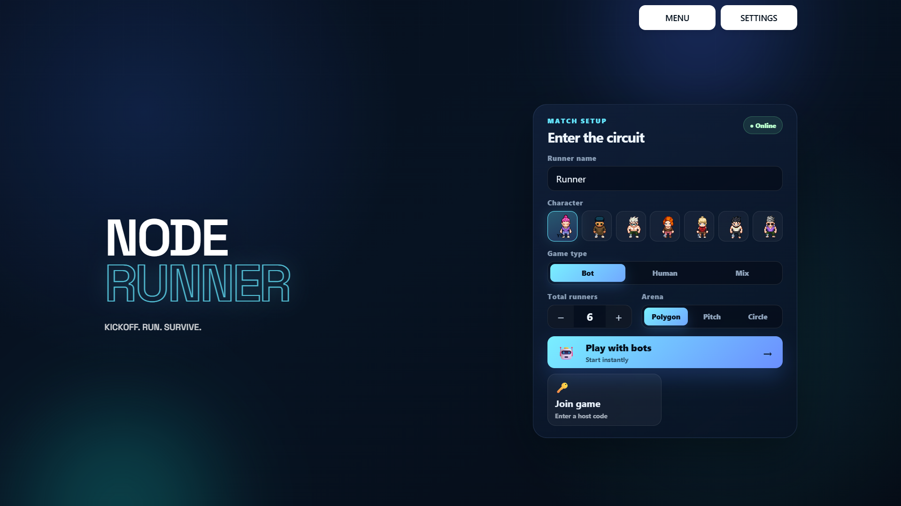
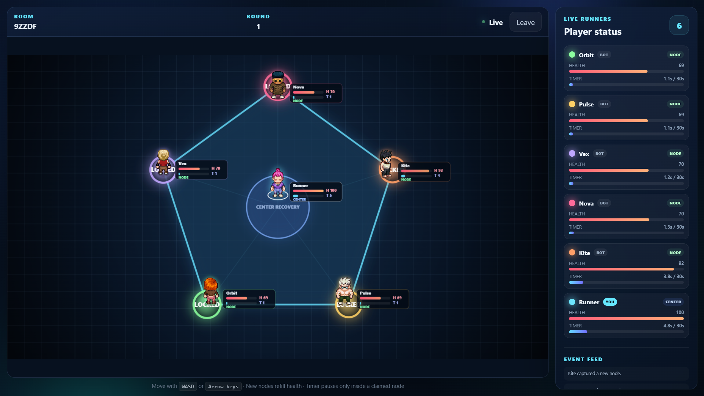
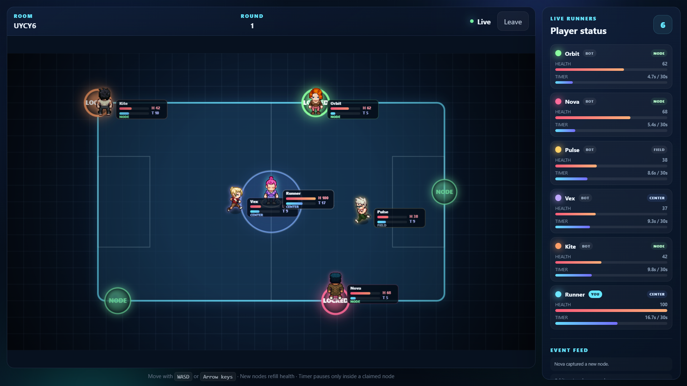
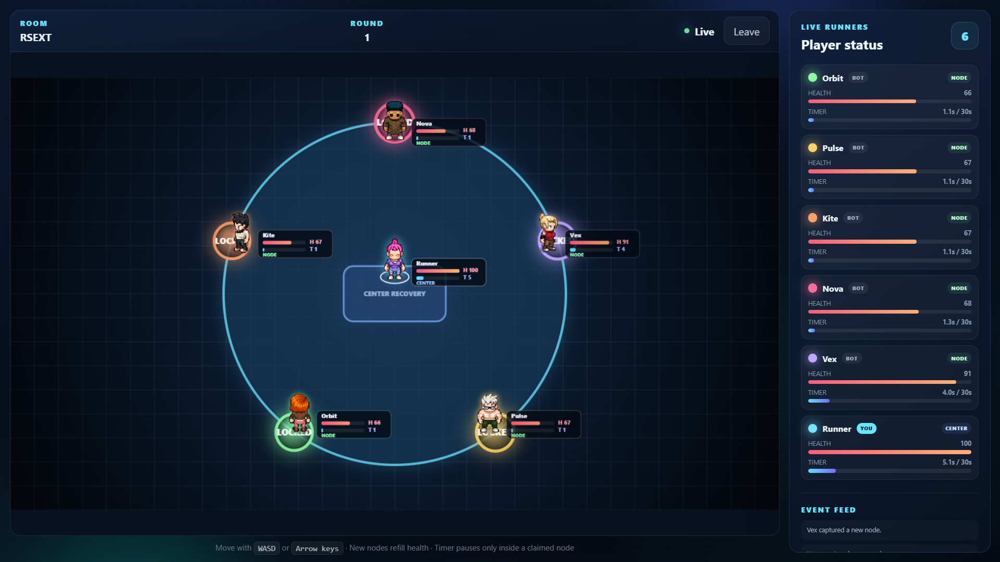
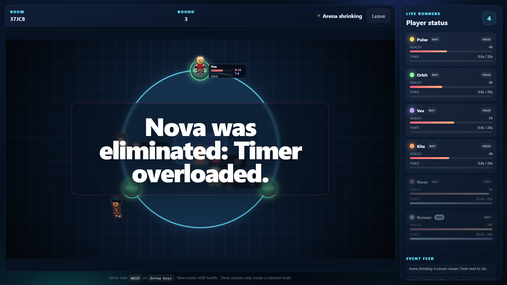
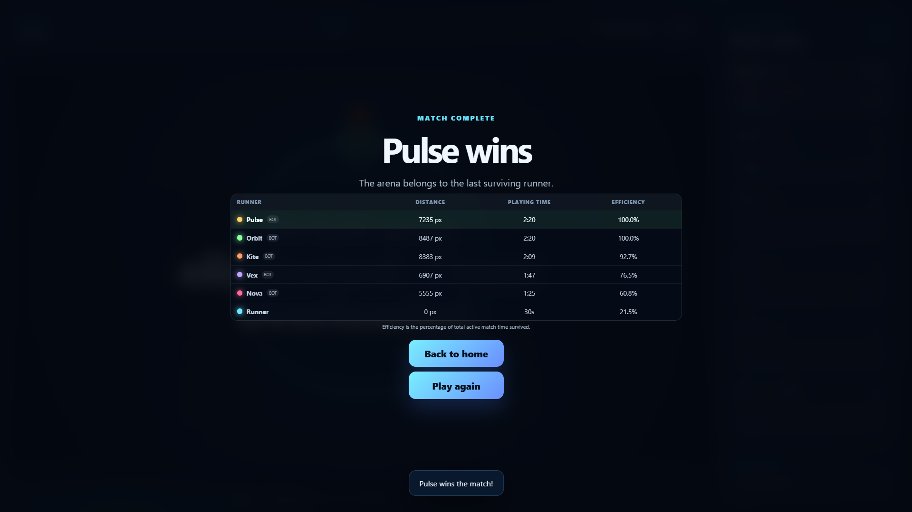

# Node Runner

**Kickoff. Run. Survive.**

Node Runner is a server-authoritative 2D survival game for 3–7 runners. Race for exclusive nodes, manage health and exposure time, and outlast every human or bot opponent as the arena shrinks around you.

[Play in your browser](https://node-runner-xayv.onrender.com) · [Windows build guide](docs/WINDOWS_BUILD.md) · [Release checklist](docs/RELEASE_CHECKLIST.md)

> Do not use VS Code Live Server. Multiplayer rooms, bots, and match simulation require the Node.js and Socket.IO server.

## Highlights

- Three game types: bots, human multiplayer, and mixed human/bot rooms
- Private host/join rooms using five-character room codes
- Polygon, football pitch, and circular arenas
- Server-owned movement, collisions, bots, health, timers, and win conditions
- Browser-local music and sound settings, records, high scores, and achievements
- Match-completion statistics for distance, playing time, and efficiency
- Browser deployment on Render plus an online Windows desktop wrapper

## How to play

Every arena has one fewer active node than living runners, so someone is always exposed.

1. Move to an unoccupied node before your exposure timer fills.
2. Capturing a different node restores your health and pauses your timer.
3. Do not remain inside a node forever—node occupation drains health.
4. Use the center to recover health slowly, but remember that your timer keeps increasing there.
5. Rotate after leaving a node; that node is locked to you for three seconds.
6. Survive each elimination and the shrinking arena. The last runner alive wins.

### Controls

| Action | Input |
|---|---|
| Move | `WASD` or arrow keys |
| Pause/resume | `Q` |
| Desktop fullscreen | `F11` or `Alt` + `Enter` |
| Leave desktop fullscreen | `Escape` |

## Game types

| Type | Description |
|---|---|
| Bot | Start instantly with one human and AI-controlled opponents. |
| Human | Host a room and wait for all human runners to join. |
| Mix | Choose human and bot counts; the match starts after the configured humans join, then bots fill the remaining slots. |

The minimum match size is three runners. Mixed games require at least two humans; total player count is capped at seven.

## Screenshots

| Home | Polygon arena |
|---|---|
|  |  |
| Football pitch | Circular arena |
|  |  |
| Elimination | Match result |
|  |  |

## Run locally

### Requirements

- Node.js 24 LTS
- npm

### Install and start

```powershell
npm install
npm start
```

Open [http://localhost:3000](http://localhost:3000).

The server listens on `0.0.0.0`, so devices on the same Wi-Fi network can connect using the host computer’s IPv4 address, for example `http://192.168.0.15:3000`. Windows Firewall may ask you to allow Node.js on private networks.

### Development and verification

```powershell
npm run dev
npm run check
npm test
```

To test multiplayer locally, open the game in two browser windows, host a room in one, then join its room code from the other.

## Deployment

### Render web service

The root [render.yaml](render.yaml) deploys the complete game as one Node web service. Express serves `public/`, Socket.IO uses the same origin, and `/health` provides the health check.

1. Push the repository to GitHub.
2. In Render, choose **New → Blueprint**.
3. Connect the repository and select [render.yaml](render.yaml).
4. Deploy the generated service.

| Setting | Value |
|---|---|
| Runtime | Node |
| Region | Singapore |
| Plan | Free |
| Instances | 1 |
| Build command | `npm ci` |
| Start command | `npm start` |
| Health check | `/health` |
| Auto deploy | Commits to `main` |

Game rooms and matches remain in memory for this game-jam build. A restart or redeploy ends active matches, and the service must remain at one instance unless shared state is introduced later.

### Windows and itch.io release

The Electron desktop edition securely loads the shared Render game, so desktop and browser players use the same multiplayer rooms. It is intentionally online-only.

- [Build the Windows portable EXE and ZIP](docs/WINDOWS_BUILD.md)
- [Prepare the itch.io submission](docs/ITCH_SUBMISSION.md)
- [Use the release checklist](docs/RELEASE_CHECKLIST.md)
- [Copy the prepared itch.io page text](docs/ITCH_PAGE_COPY.md)

## Architecture

```text
Browser or Electron client
        │  Socket.IO + HTTP (same origin)
        ▼
Express / Socket.IO server
        │
        ├── rooms and lobby composition
        ├── authoritative movement and collisions
        ├── bots, health, timers, and eliminations
        └── snapshots and game events
```

### Repository map

```text
Node_runner/
├── server.js                    # Express, HTTP, Socket.IO, and /health
├── server/                      # Authoritative simulation and arena rules
├── public/                      # Browser UI, Canvas renderer, audio, and client
├── desktop/                     # Secure Electron wrapper and offline screen
├── tests/                       # Game and preference tests
├── docs/                        # Windows and itch.io release documentation
├── Asset/                       # Screenshots and music
├── charcters/                   # Character sprites (name retained for routes)
├── electron-builder.config.cjs # Windows packaging configuration
├── render.yaml                 # Render Blueprint
└── package.json
```

### Key files

- [server/GameRoom.js](server/GameRoom.js) — rooms, players, bots, movement, collisions, rounds, and scoring
- [server/arena.js](server/arena.js) — arena geometry and movement boundaries
- [server/constants.js](server/constants.js) — gameplay balance values
- [public/js/GameClient.js](public/js/GameClient.js) — Socket.IO requests, snapshots, input, and reconciliation
- [public/js/Renderer.js](public/js/Renderer.js) — Canvas arena and player rendering
- [public/js/UI.js](public/js/UI.js) — menus, lobby, settings, status, and results
- [public/js/PlayerPreferences.js](public/js/PlayerPreferences.js) — local settings, records, and achievements

## Current balance

All tuning values are defined in [server/constants.js](server/constants.js).

| Mechanic | Value |
|---|---:|
| Maximum health | 100 |
| Initial timer | 30 seconds |
| Timer reduction after a shrink | 5 seconds |
| Minimum round timer | 5 seconds |
| Player speed | 228 px/s |
| Node health drain | 8.5 health/s |
| Field health drain | 0.75 health/s |
| Center recovery | 5.5 health/s |
| Personal node re-entry lock | 3 seconds |
| Initial countdown | 3 seconds |
| Arena transition | 6 seconds |

## Known limitations

- All clients in a room must connect to the same running server instance.
- Disconnected runners are removed from an active match.
- There is no account system, public matchmaking, or reconnect-to-match support.
- Settings and progress are stored only in the current browser or desktop profile.
- The Windows edition requires internet access because the shared Render server hosts rooms, bots, and authoritative simulation.

## Technology

JavaScript · HTML5 Canvas · Node.js · Express · Socket.IO · Electron

## License and copyright

Copyright © 2026 Node Runner project authors. All rights reserved.

This source code, game, and accompanying materials may not be copied, modified, redistributed, sublicensed, or used commercially without prior written permission from the copyright holders. No licence is granted except the limited permission required to view this public repository and run the game for personal evaluation.

Third-party assets and dependencies remain subject to their respective licences and copyright terms.
